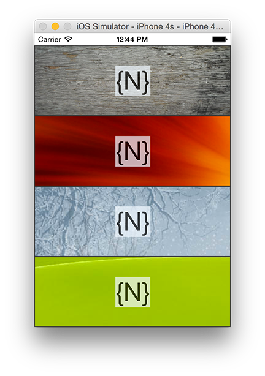

You might be thinking that backgrounds are a pretty simple thing to set on your views, and you're right! NativeScript provides methods for us to set background images as element attributes in the XML as well as set backgrounds though CSS. However, there might be a time when you want to dynamically load a background. This short post shows you four methods how to do that. 

#### Versions used in this post 

* NativeScript: 1.0.1

#### Related optional downloads

* [Backgrounds Sample App](https://github.com/alexziskind1/nativescript-backgrounds-demoapp)

> **Note:** This post assumes you are already familiar with using NativeScript. If you are not, what are you waiting for? [Start here.](http://docs.nativescript.org/hello-world/hello-world-ns-cli)

* * *

#### [Method 1 – Using CoreGraphics Framework Extensions](#Method1)

#### [Method 2 – Using Color Pattern](#Method2)

#### [Method 3 – Using an Image Background View Loaded from File](#Method3)

#### [Method 4 – Using an Image Background View Loaded from the Webs](#Method4)

* * *

You can grab the [sample code on GitHub](https://github.com/alexziskind1/nativescript-backgrounds-demoapp) and try it out yourself. The sample is made up of four `Border` elements, each of which loads a background in a different manner as described in this post. The XML structure for the sample looks like this 

```
<page xmlns="http://www.nativescript.org/tns.xsd">
    <gridlayout rows="*, *, *, *" columns="*">
        <border row="0" col="0" borderwidth="1" bordercolor="#333333" loaded="borderLoaded1">
            <button text="{N}" cssclass="btn-action" tap="{{ btnTap }}"></button>
        </border>
        <border row="1" col="0" borderwidth="1" bordercolor="#333333" loaded="borderLoaded2">
            <button text="{N}" cssclass="btn-action" tap="{{ btnTap }}"></button>
        </border>
        <border row="2" col="0" borderwidth="1" bordercolor="#333333" loaded="borderLoaded3">
            <button text="{N}" cssclass="btn-action" tap="{{ btnTap }}"></button>
        </border>
        <border row="3" col="0" borderwidth="1" bordercolor="#333333" loaded="borderLoaded4">
            <button text="{N}" cssclass="btn-action" tap="{{ btnTap }}"></button>
        </border>
    </gridlayout>
</page>
```
> **Note:** Pay special attention to the `loaded` attributes on each of the `Border` elements.

When the app runs each of the four `Border` elements fires a `loaded` event and the backgrounds are loaded. This is the result running in an iOS simulator.



<h2 id="Method1">Method 1 – Using CoreGraphics framework extensions</h2>

This is probably the simplest method to use to load a background dynamically. Another benefit of this method is that the background image is automatically scaled for you to fit into the provided space.

```
function borderLoaded1(args) {
    if (!args.object.ios) return; //This method is only for iOS
    var theView = args.object._view;
    theView.layer.contents = UIImage.imageNamed("app/res/background1.jpeg").CGImage;
}
```

<h2 id="Method2">Method 2 – Using Color Pattern</h2>

Another neat trick is to set the background color of a view. Instead of using a simple color like red or green, you're initializing a color with an pattern image; your background image.

```
function borderLoaded2(args) {
    if (!args.object.ios) return; //This method is only for iOS
    var theView = args.object._view;
     
    var image = UIImage.imageNamed("app/res/background2.jpeg");
    var background = UIColor.alloc().initWithPatternImage(image);   
    theView.backgroundColor = background;
    background.release();
}
```

<h2 id="Method3">Method 3 – Using an Image Background View Loaded from File</h2>

This method is not my preferred way of setting the background from a locally deployed image file, but it is just another tool for your belt. Plus it displays the image relative to the parent frame and therefore doesn't need to be repositioned, if that's the effect that you're after.

```
function borderLoaded3(args) {
    if (!args.object.ios) return; //This method is only for iOS
    var theView = args.object._view;
     
    //Get image from deployed file
    var imgPath = NSBundle.mainBundle().pathForResourceOfType("app/res/background3", "jpeg");
    var imgUrl = NSURL.fileURLWithPath(imgPath);
     
    var imgData = NSData.dataWithContentsOfURL(imgUrl);
    var img = UIImage.imageWithData(imgData);
    var imageView = UIImageView.alloc().initWithImage(img);
 
    theView.addSubview(imageView);
    theView.sendSubviewToBack(imageView);
}
```

<h2 id="Method4">Method 4 – Using an Image Background View Loaded from the Webs</h2>

This is effectively the same method as Method 3, but instead of using a locally deployed image file, the file is downloaded from an Internet address, for ultimate flexibility in managing your backgrounds.

```
function borderLoaded4(args) {
    if (!args.object.ios) return; //This method is only for iOS
    var theView = args.object._view;
     
    //Get image from internet URL
    var imgUrl = NSURL.alloc().initWithString("http://www.dvd-ppt-slideshow.com/images/ppt-background/background-9.jpg");
 
    var imgData = NSData.dataWithContentsOfURL(imgUrl);
    var img = UIImage.imageWithData(imgData);
    var imageView = UIImageView.alloc().initWithImage(img);
 
    theView.addSubview(imageView);
    theView.sendSubviewToBack(imageView);
}
```

## Summary

There are probably countless more methods for setting background images dynamically. Hopefully this gives you some ideas on what you can do to get started with your own dynamic images. Feel free to experiment.
