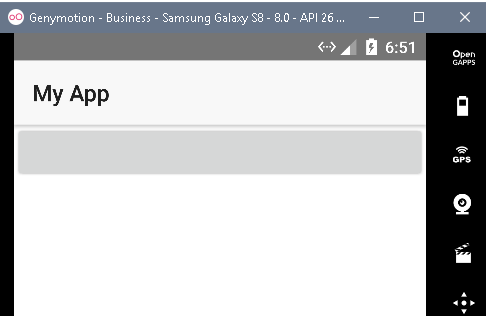
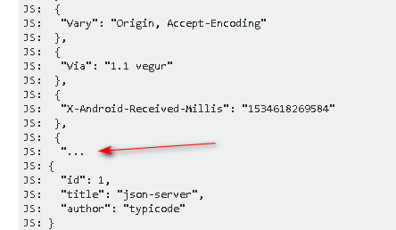

What's a simple thing all developers really want from complex, network-bound mobile app?

<br/>

We want to find network related actions and errors as quickly as possible, without all the headaches of setting up proxies and certificates to sniff our HTTP requests and responses. We want to very that all the headers are correct, perhaps after login, perhaps even the JWT! Here'a simple solution.

<br/><br/>

## Current State of Affairs

Currently we program against an IDE and a console. Normally if we want to see the network traffic we can attach Fiddler (or Charles if you're on a Mac, or some other sniffer) and we can also start debug mode using Chrome.

<br/>

Now, this is where things gets complicated.

<br/>

Working in debug mode just to see network operations can make our life a bit harder. Why? Chrome's socket sometimes disconnect and you need to `tns run android --start` or `tns debug android` again and again.

<br/>

What about Fiddler or Wireshark? Well you'd have to create a proxy so that your device will make network operations through your network card and not by its own. Not to mention that if an SSL traffic is occurring, then fiddler has its own certificate which can break trust certificate chain. You'd have to install its certificate in the device trusted certificates.

<br/>

And I ask - why all this mess?
All I've asked is to see request summary, response (all or brief) summary - just to see that the server likes me and that things are going well. That's all.

<br/><br/>

## Intercept This

Let's dive right into the code, and I'll explain along the way. First we need to create a custom interceptor TypeScript file.

<br/>

[**custom.interceptor.ts**](https://gist.github.com/royinamir/f81862aec4fe70fb0b6e82e92adddfb3)

```typescript
import {
  HttpErrorResponse,
  HttpEvent,
  HttpHandler,
  HttpInterceptor,
  HttpRequest,
  HttpResponse
} from '@angular/common/http';
import { Injectable } from '@angular/core';
import { Observable } from 'rxjs';
import { tap } from 'rxjs/operators';

@Injectable()
export class CustomInterceptor implements HttpInterceptor {
  log = (req: HttpRequest<any>) =>
    tap(
      (res: HttpEvent<any>) => {
        if (res instanceof HttpResponse) {
          console.log(this.logJson(req, res));
        }
      },
      res => {
        if (res instanceof HttpErrorResponse) {
          console.log(this.logJson(req, res));
        }
      }
    );

  logJson(req: HttpRequest<any>, res): string {
    return `
        Method=${req.method}
       Url=${req.urlWithParams}
       Url Params=${JSON.stringify(
         req.params
           .keys()
           .reduce((acc, c) => ((acc[c] = req.params.get(c)), acc), {})
       )}
       Body Params=${JSON.stringify(req.body, null, ' ')}
       Headers=${JSON.stringify(
         req.headers.keys().map(x => ({ [x]: req.headers.get(x) })),
         null,
         ' '
       )}
       ----------------------------------------------------------------------------
       Response=${JSON.stringify(res, null, ' ')}
       Headers=${JSON.stringify(
         res.headers.keys().map(x => ({ [x]: res.headers.get(x) })),
         null,
         ' '
       )}`;
  }

  intercept(
    req: HttpRequest<any>,
    next: HttpHandler
  ): Observable<HttpEvent<any>> {
    return next.handle(req).pipe(this.log(req));
  }
}
```

<br/>

The `logJson` method will read the request and response headers, response, query parameters and body parameters. We will then display it nicely through `JSON.stringify` with the overload of `null, " "`

<br/>

The method will show log the request and response like this:

<br/>

```
    request ...
    ----------------------------------------
    response ...
```

<br/>

Before using this interceptor, we must declare it in the app module file in the providers section:

```typescript
    providers: [
                    ...
                    {
                        provide : HTTP_INTERCEPTORS,
                        useClass: CustomInterceptor,
                        multi   : true
                    }
                ],
```

That's all actually. You don't have to do anything else.

<br/><br/>

## Taking It for a Spin

Let's try to create a network request. You can use my free json-server [persistent crud tester that I've build](https://servercrud2.herokuapp.com/)

<br/>

Let's first create a button

```xml
   <StackLayout class="page">
     <button (tap)="onButtonTap($event)"></button>
   </StackLayout>
```

<br/>

which invokes this method

```typescript
onButtonTap($event) {
  this._dataService.getData().subscribe(
    res => {
      console.log(res);
    },
    error => {}
  );
}
```

<br/>

Where `_dataService` is of the type `DataService`, and it's just a service to fetch data from. This is the `DataService` implementation

```typescript
@Injectable()
export class DataService {
  constructor(private _httpService: HttpService) {}

  public getData<T>(params?: { [param: string]: string }): Observable<T> {
    return this._httpService.get<T>(
      'https://servercrud2.herokuapp.com/posts/1',
      params
    );
  }
}
```

<br/>

And `HttpService` is a service which is responsible for the actual network operations

```typescript
@Injectable()
export class HttpService {
  constructor(private _http: HttpClient) {}

  public get<T>(
    url: string,
    params: { [param: string]: string }
  ): Observable<T> {
    return this._http.get<T>(url, { params });
  }
}
```

<br/>

So if we tap the button

<br/>



<br/>

We can see this log printed out

```
      Method=GET
     Url=https://servercrud2.herokuapp.com/posts/1
     Url Params={}
     Body Params=null
     Headers=[]
     ----------------------------------------------------------------------------
     Response={
      "headers": {
       "normalizedNames": {},
       "lazyUpdate": null
      },
      "status": 200,
      "statusText": "OK",
      "url": "https://servercrud2.herokuapp.com/posts/1",
      "ok": true,
      "type": 4,
      "body": {
       "id": 1,
       "title": "json-server",
       "author": "typicode"
      }
     }
     Headers=[
      {
       "null": "HTTP/1.1 200 OK"
      },
      {
       "Access-Control-Allow-Credentials": "true"
      },
      {
       "Cache-Control": "no-cache"
      },
      {
       "Connection": "keep-alive"
      },
      {
       "Content-Length": "63"
      },
      {
       "Content-Type": "application/json; charset=utf-8"
      },
      {
       "Date": "Sat, 18 Aug 2018 18:51:10 GMT"
      },
      {
       "Etag": "W/\"3f-ApGYAlkiEU7eUDcnHqNL7illO4Y\""
      },
      {
       "Expires": "-1"
      },
      {
       "Pragma": "no-cache"
      },
      {
       "Server": "Cowboy"
      },
      {
       "Vary": "Origin, Accept-Encoding"
      },
      {
       "Via": "1.1 vegur"
      },
      {
       "X-Android-Received-Millis": "1534618269584"
      },
      {
       "...
     {
       "id": 1,
       "title": "json-server",
       "author": "typicode"
     }
```

<br/>

Well, as you can see in the same console, you get to see all what you need. No certificates installations. No Fiddler or Wireshark. No nothing!

<br/>

You might ask yourself: Well what if I fetch two hundred records of JSON objects? I don't want to see it all in the screen.

<br/>

Well there is an answer to that too. Do you see this `...`?

<br/>



<br/>

Since version 4.1, NativeScript provides the ability to truncate or enlarge the amount of console log. The [default is 1024 characters](https://docs.nativescript.org/core-concepts/android-runtime/advanced-topics/custom-flags#maximum-log-message-size).

<br/>

You can set it in the `package.json` file:

```json
    "android": {
                    "maxLogcatObjectSize": 2048
            }
```

<br/>

Let's change the `maxLogcatObjectSize` value to 512.

<br/>

Here's the result:

```
      Method=GET
     Url=https://servercrud2.herokuapp.com/posts/1
     Url Params={}
     Body Params=null
     Headers=[]
     ----------------------------------------------------------------------------
     Response={
      "headers": {
       "normalizedNames": {},
       "lazyUpdate": null
      },
      "status": 200,
      "statusText": "OK",
      "url": "https://servercrud2.herokuapp.com/posts/1",
      "ok": true,
      "type": 4,
      "body": {
       "id": 1,
       "title": "json-server",
       "author": "typicode"
      }
     }
     Headers=[
      {
       "null": "HTTP/1.1 200 OK"
      },
      {
       "Access-Control-Al...
     {
       "id": 1,
       "title": "json-server",
       "author": "typicode"
     }
```

<br/>

Much shorter, right?

<br/>

Well you get the point. It helps you see request info and response info.

<br/><br/>

## Errors Anyone?

Do notice the `-------------------------------` line. Again, above this line is the request and below it is the response.

<br/>

Let's try something which will cause an error.

Change the url to

```typescript
public getData<T>(params?: { [param: string]: string }): Observable<T> {
    return this._httpService.get<T>("https://servercrud2.herokuapp.com/posts/notExists", params);
}
```

<br/>

Notice `notExists`. Now let's try it again.

```
      Method=GET
     Url=https://servercrud2.herokuapp.com/posts/notExists
     Url Params={}
     Body Params=null
     Headers=[]
     ----------------------------------------------------------------------------
     Response={
      "headers": {
       "normalizedNames": {},
       "lazyUpdate": null
      },
      "status": 404,
      "statusText": "Not Found",
      "url": "https://servercrud2.herokuapp.com/posts/notExists",
      "ok": false,
      "name": "HttpErrorResponse",
      "message": "Http failure response for https://servercrud2.herokuapp.com/posts/notExists: 404 Not Found",
      "error": {}
     }
     Headers=[
      {
       "null": "HTTP/1.1 404 Not Found"
      },
      {
       "Access-Control-Allow-Credentials": "true"
      },
      {
       "Cache-Control": "no-cache"
      },
      {
       "Connection": "keep-alive"
      },
      {
       "Content-Length": "2"
      },
      {
       "Content-Type": "application/json; charset=utf-8"
      },
      {
       "Date": "Sat, 18 Aug 2018 19:00:43 GMT"
      },
      {
       "Etag": "W/\"2-vyGp6PvFo4RvsFtPoIWeCReyIC8\""
      },
      {
       "Expires": "-1"
      },
      {
       "Pragma": "no-cache"
      },
      {
       "Server": "Cowboy"
      },
      {
       "Vary": "Origin, Accept-Encoding"
     ...
```

<br/>

You can easily see what response you get, what the headers are, etc. You might want to add an `AppSettings` injected service where you have:

```
isEnableHttpLogging:true
```

<br/>

So that the interceptors will log only by a conditional environment flag.

<br/><br/>

## Final Words

This technique saved me a lot of effort trying to declare proxies, certificates (to decypher the SSL content), and watch yet another window on my desktop. It is extremely simple to notice and verify that you send the right stuff, and get the right stuff back.

<br/>

Until the next article, Take care. ;-)
